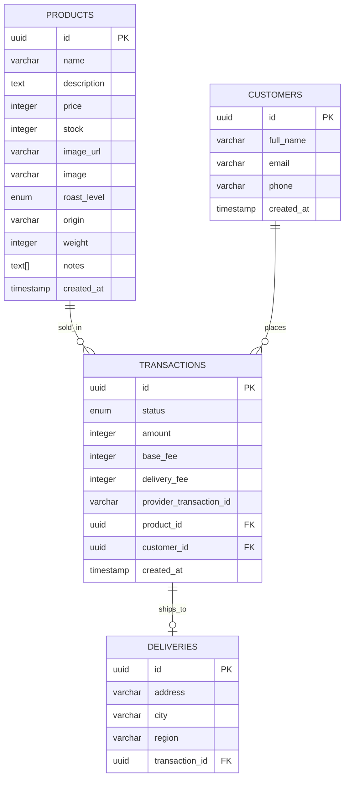
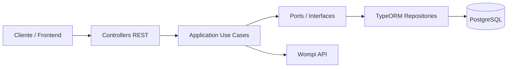

# Coffee Shop E-commerce Backend

Backend del e-commerce de Origen Coffee construido con NestJS, TypeORM y PostgreSQL. La API expone el catalogo publico de productos, procesa pagos con Wompi, registra clientes, crea entregas y genera el recibo de cada transaccion.


## Tabla de contenido

- [Resumen](#resumen)
- [Swagger](#swagger)
- [Diagrama relacional](#diagrama-relacional)
- [Arquitectura](#arquitectura)
- [Coverage](#coverage)
- [Como correr la app](#como-correr-la-app)
- [GitHub Actions](#github-actions)

## Resumen

### Que hace esta API

- Lista productos disponibles para compra.
- Consulta el detalle de un producto por `id`.
- Procesa pagos contra Wompi validando el total calculado por backend.
- Crea o reutiliza clientes en cada checkout.
- Registra la entrega asociada a la transaccion.
- Permite consultar el recibo de una compra.

### Reglas de negocio relevantes

- El backend no confia en el total enviado por frontend: recalcula el valor a cobrar.
- El total se compone de:
  `precio del producto + 1.500 COP (base fee) + 12.000 COP (delivery fee)`.
- El valor que se envia al proveedor se valida en centavos.
- Si el pago queda `APPROVED`, se descuenta stock.
- Si el proveedor rechaza la compra, la transaccion se marca como `FAILED`.

### Stack principal

- NestJS 11
- TypeORM 0.3
- PostgreSQL
- Swagger (`@nestjs/swagger`)
- Jest para pruebas y cobertura
- GitHub Actions para CI/CD
- Docker + Amazon ECR/ECS para despliegue

### Endpoints principales

| Metodo | Ruta | Descripcion |
| --- | --- | --- |
| `GET` | `/products` | Lista catalogo publico con productos disponibles |
| `GET` | `/products/:id` | Retorna la ficha completa de un producto |
| `POST` | `/transactions` | Procesa el checkout y crea la transaccion |
| `GET` | `/transactions/:id` | Consulta el recibo de una transaccion |

## Swagger

- https://api-coffee-shop.jdvalencir.com/docs#/

La documentacion OpenAPI se genera automaticamente al iniciar la aplicacion y queda publicada en:

- `http://localhost:3000/docs`

Configuracion actual:

- Titulo: `Origen Coffee E-commerce API`
- Version: `1.0`
- Ruta de montaje: `/docs`


### Payload de checkout esperado

El endpoint `POST /transactions` recibe:

- `amount`: monto en centavos
- `cardToken`: token de tarjeta emitido por Wompi
- `productId`: UUID del producto
- `fullName`
- `email`
- `phone`
- `address`
- `city`
- `region`

## Diagrama relacional



### Relaciones clave

- Un producto puede estar asociado a muchas transacciones.
- Un cliente puede realizar muchas transacciones.
- Una transaccion puede tener una entrega asociada.
- `deliveries.transaction_id` es `UNIQUE`, por lo que la relacion con `transactions` es uno a uno.

## Arquitectura

El proyecto sigue una separacion por modulos de negocio con una estructura cercana a arquitectura hexagonal / clean architecture:

- `application`: casos de uso y contratos (ports).
- `domain`: errores y reglas de dominio.
- `infraestructure`: controllers, adapters externos, repositorios TypeORM, entidades y DTOs.
- `core`: tokens de inyeccion, errores compartidos, filtros HTTP y utilidades.



### Modulos

- `StockModule`: consulta de catalogo y detalle de productos.
- `CustomersModule`: persistencia y busqueda/creacion de clientes.
- `DeliveriesModule`: persistencia de la informacion de entrega.
- `TransactionsModule`: checkout, integracion con Wompi y recibos.

### Flujo de pago

1. El controller recibe el checkout.
2. El caso de uso valida el producto y su stock.
3. Recalcula el total a pagar desde backend.
4. Crea o reutiliza el cliente.
5. Registra una transaccion `PENDING`.
6. Crea la entrega asociada.
7. Llama a Wompi mediante `WompiApiAdapter`.
8. Actualiza el estado de la transaccion.
9. Si el pago fue aprobado, descuenta stock.

### Diagrama de despliegue


## Coverage

Reporte local tomado de `coverage/lcov-report/index.html`.

| Metrica | Resultado | Cobertura |
| --- | --- | --- |
| Statements | `356/358` | `99.44%` |
| Branches | `108/131` | `82.44%` |
| Functions | `50/51` | `98.03%` |
| Lines | `322/324` | `99.38%` |

El proyecto define umbral minimo global de `80%` para:

- statements
- branches
- functions
- lines


## Como correr la app

### Prerrequisitos

- Node.js 22 recomendado
- pnpm 10
- PostgreSQL

### Variables de entorno

Puedes partir de `.env.example`:

```bash
cp .env.example .env
```

Variables usadas por la aplicacion:

| Variable | Descripcion | Valor por defecto / ejemplo |
| --- | --- | --- |
| `DB_HOST` | Host de PostgreSQL | `localhost` |
| `DB_PORT` | Puerto de PostgreSQL | `5433` en `.env.example` |
| `DB_USER` | Usuario de BD | `postgres` |
| `DB_PASSWORD` | Password de BD | `postgres` |
| `DB_NAME` | Nombre de BD | `coffee_shop` |
| `PORT` | Puerto HTTP de la API | `3001` en `.env.example` |
| `NODE_ENV` | Entorno de ejecucion | `development` |
| `WOMPI_API_URL` | URL base de Wompi | sandbox |
| `WOMPI_PUBLIC_KEY` | Llave publica Wompi | ejemplo |
| `WOMPI_PRIVATE_KEY` | Llave privada Wompi | ejemplo |
| `WOMPI_INTEGRITY_KEY` | Llave de integridad Wompi | ejemplo |

### Instalacion

```bash
pnpm install
```

### Inicializar base de datos

Corre migraciones:

```bash
pnpm run migration:run
```

Carga el catalogo inicial:

```bash
pnpm run seed:run
```

El seeder inserta productos solo si la tabla `products` esta vacia.

### Ejecutar en desarrollo

```bash
pnpm run start:dev
```

Otras variantes:

```bash
pnpm run start
pnpm run start:debug
pnpm run build
pnpm run start:prod
```

### Ejecutar pruebas

```bash
pnpm run test
pnpm run test:unit
pnpm run test:cov
pnpm run test:e2e
```

### Orden recomendado para levantar el proyecto

1. Configurar `.env`.
2. Levantar PostgreSQL.
3. Ejecutar `pnpm install`.
4. Ejecutar `pnpm run migration:run`.
5. Ejecutar `pnpm run seed:run`.
6. Ejecutar `pnpm run start:dev`.
7. Abrir `http://localhost:3001/docs`.

## GitHub Actions

El flujo de CI/CD esta definido en `.github/workflows/deploy-aws.yml`.

### Cuando se ejecuta

- En cada `push` a la rama `main`.
- Manualmente desde GitHub con `workflow_dispatch`.

### Estructura del pipeline

#### Job `verify`

Este job valida que el proyecto este sano antes de desplegar:

1. Hace checkout del repositorio.
2. Configura `pnpm` 10.
3. Configura Node.js 22.
4. Ejecuta `pnpm install --frozen-lockfile`.
5. Ejecuta `pnpm run build`.
6. Ejecuta `pnpm run test:unit:cov`.

#### Job `deploy`

Solo corre si `verify` termina bien.

1. Hace checkout del repositorio.
2. Configura credenciales de AWS.
3. Hace login en Amazon ECR.
4. Construye la imagen Docker usando el `Dockerfile`.
5. Publica la imagen en ECR con tag igual al SHA del commit.
6. Ejecuta migraciones dentro del contenedor con `pnpm run migration:run:prod`.
7. Ejecuta el seeder compilado con `pnpm run seed:run:prod`.
8. Descarga la task definition actual (`coffee-shop-api-task`).
9. Reemplaza la imagen del contenedor objetivo.
10. Despliega la nueva revision en Amazon ECS.

### Variables y secrets requeridos

#### Repository variables

- `AWS_REGION`
- `ECR_REPOSITORY`
- `ECS_CLUSTER`
- `ECS_SERVICE`
- `ECS_CONTAINER_NAME`

#### Repository secrets

- `AWS_ACCESS_KEY_ID`
- `AWS_SECRET_ACCESS_KEY`
- `DB_HOST`
- `DB_PORT`
- `DB_USER`
- `DB_PASSWORD`
- `DB_NAME`

### Consideraciones importantes del workflow

- El nombre de la task definition consultada esta hardcodeado como `coffee-shop-api-task`.
- Las migraciones y seeders se ejecutan en cada despliegue.
- El seeder no duplica productos si ya existe informacion en `products`.
- El despliegue espera estabilidad del servicio (`wait-for-service-stability: true`).


## Estructura base del proyecto

```text
src/
  core/
  database/
    config/
    migrations/
    seeds/
  modules/
    customers/
    deliveries/
    products/
    transactions/
```

## Notas adicionales

- Swagger se monta automaticamente al iniciar la app.
- TypeORM usa `synchronize: false`; la fuente de verdad son las migraciones.
- Si `DB_HOST` contiene `rds`, la conexion habilita SSL.
- La pasarela de pagos usa Wompi sandbox por defecto.
